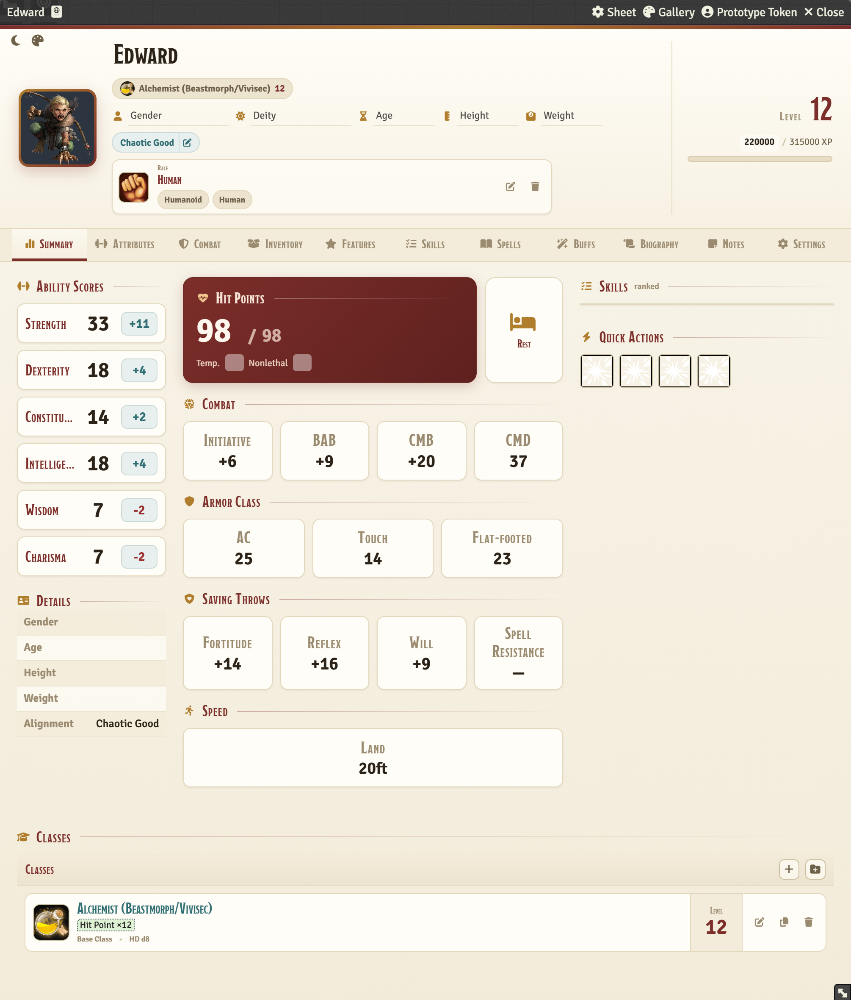
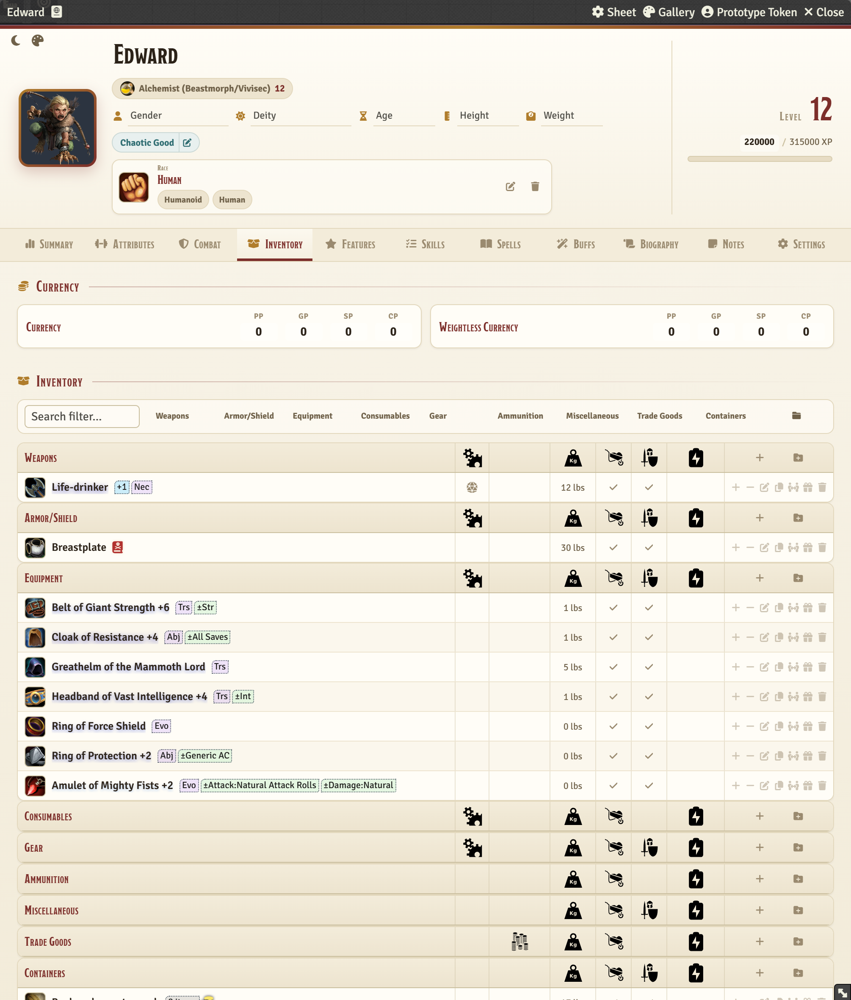
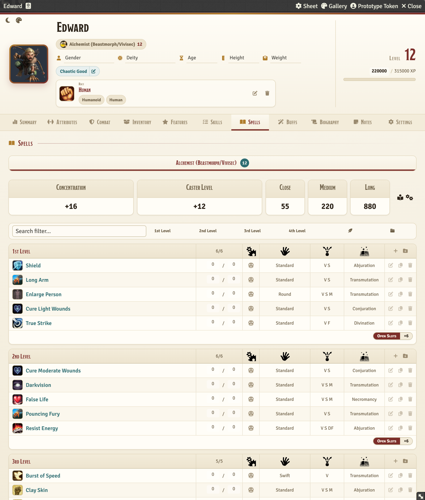
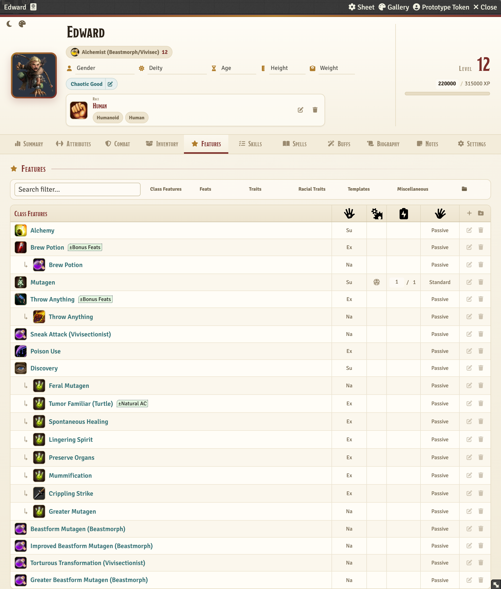
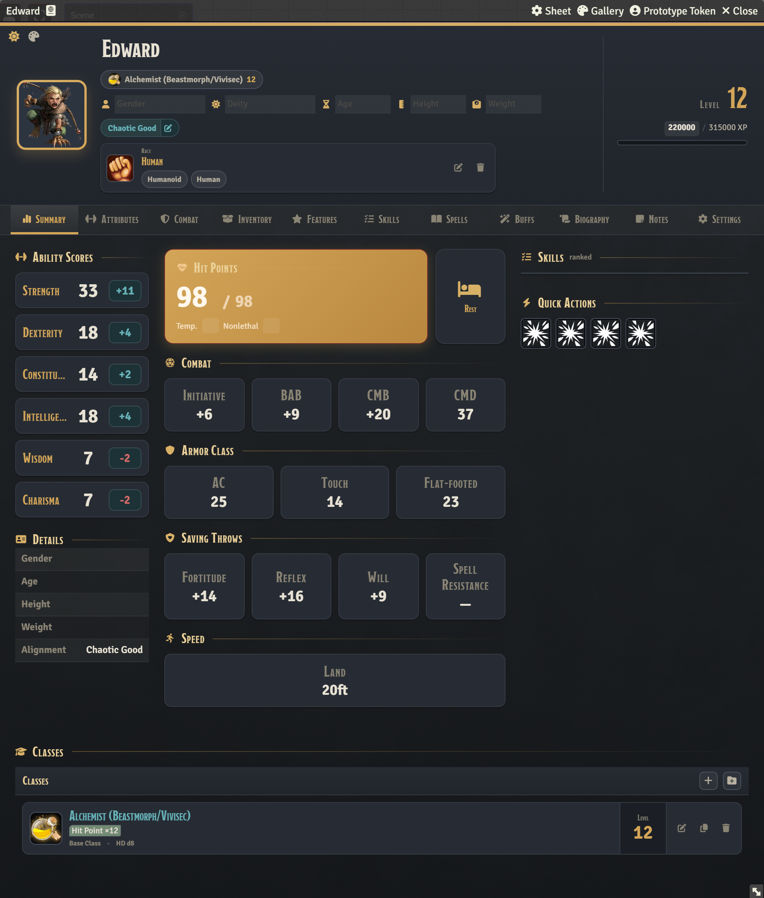
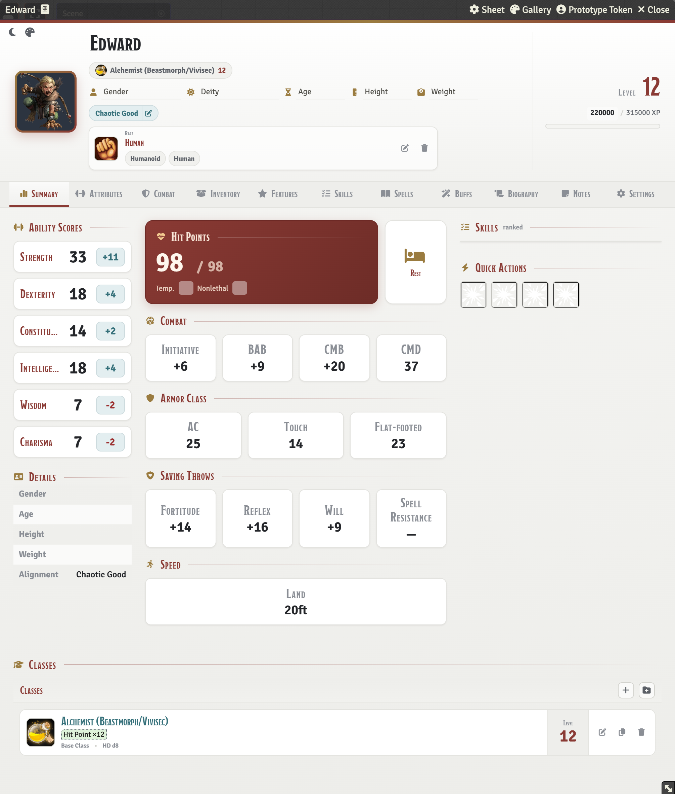

# PF1E Alt Sheet Reworked

A modernized alternative character sheet for the **Pathfinder 1e (PF1E)** system on **Foundry VTT v13**.

Three selectable themes, dark mode, inline container contents, nested feature links and a layout built for readability — while all rules, rolls and data handling stay with the PF1E system.

## Installation

In Foundry VTT: **Add-on Modules → Install Module**, paste this manifest URL and click *Install*:

```
https://github.com/Chandriano131/pf1-altsheet-reworked/releases/latest/download/module.json
```

Then enable the module, open a PF1E actor sheet, click the sheet configuration icon and select **"Alt PC Sheet (Reworked)"** (or **"Alt NPC Sheet (Reworked)"**).

<details>
<summary>Manual installation</summary>

1. Download `module.zip` from the [latest release](https://github.com/Chandriano131/pf1-altsheet-reworked/releases/latest)
2. Extract it into `{your-foundry-data}/modules/pf1-altsheet-reworked/`
3. Make sure `module.json` sits at the root of that folder
4. Enable the module in Foundry VTT's module settings

</details>

## Screenshots

| Summary | Inventory |
|---|---|
|  |  |

| Spells | Features |
|---|---|
|  |  |

> In the **Features** tab, items linked as children appear indented beneath their
> parent — an Alchemist's *Discovery* and its discoveries, for example — instead
> of being scattered through the list.

The same sheet in dark mode and in the other two themes:

| Dark mode | Hybrid (native-like) | Neutral Slate |
|---|---|---|
|  |  |  |

## Features

### Sheet & layout
- Alternative sheet registered for both **character and NPC** PF1E actors
- Persistent header with portrait, name, biographical info, level and XP
- Icon-based tab navigation with clear active states and equal-width tabs
- Custom layouts for Summary, Attributes, Combat, Inventory, Features, Skills, Spells and Buffs
- Responsive layouts that reflow for narrower sheet windows
- Tabular figures so number columns stay aligned as values change

### Themes & display
- **Three selectable visual themes** — *Refined Parchment*, *Hybrid (native-like)* and *Neutral Slate*
- **Dark mode** toggle, combinable with any theme (six looks in total)
- Both switchable per user, from the module settings or the buttons in the sheet header
- **Compact mode** for denser inventory and container rows

### Inventory & containers
- **Inline container contents** — expand a container to see its items in a child table, without opening the container sheet
- Drag and drop items into containers, with themed drop feedback
- Empty containers show an inviting drop zone; child rows have a visible drag grip
- Currency, encumbrance and carried/equipped state at a glance

### Features & spells
- **Nested feature links** — features that link child items (an Alchemist's *Discovery* and its discoveries, for example) show those children indented beneath the parent
- PF1E spellbook and settings integrated with the module's visual language
- Spell rows aligned with their headers, with activation, components and school columns

### Rolls & interaction
- Rollable stats — abilities, saves, initiative, BAB/CMB, attacks and skills — wired to the PF1E roll API
- Animated d20 on hover for rollable dice icons
- Configurable Summary skill list (ranked / class skills / all)
- Visible keyboard focus outlines throughout

### Localization
- English and Brazilian Portuguese module labels

**Planned:** additional localization (de, es).

## Module compatibility

- **[Koboldworks Item Hints](https://foundryvtt.com/packages/mkah-pf1-item-hints)** — hint chips render correctly on the sheet, including in dark mode and on the class list.

## Known limitations

- Targeted at **Foundry VTT v13** and **PF1E 11.11**; Foundry v14 is not currently supported
- The Spells tab reuses the PF1E system's spellbook partial to preserve system behaviour, so it follows the system's structure more closely than the other tabs

## Compatibility

| Software | Version |
|----------|---------|
| Foundry VTT | v13 |
| PF1E System | v11.11 |

## Credits and attributions

This module is a modernization and recreation of the original **PF1 Alt Sheet** module (`pf1-alt-sheet`), used as technical and conceptual reference. The **Pathfinder 1e for Foundry VTT** system was also used as a reference for compatibility, data structure and Foundry VTT v13 integration.

All credits to the original authors of the base module and of the PF1E system are preserved:

- **PF1 Alt Sheet** (original): Tryss Farron (Fair Strides), Zenvy
- **Pathfinder 1e for Foundry VTT**: the PF1E system development team

## License

The original PF1 Alt Sheet reference module is licensed under **GNU GPL v3**. This reworked module preserves all applicable obligations and attributions of that license.
